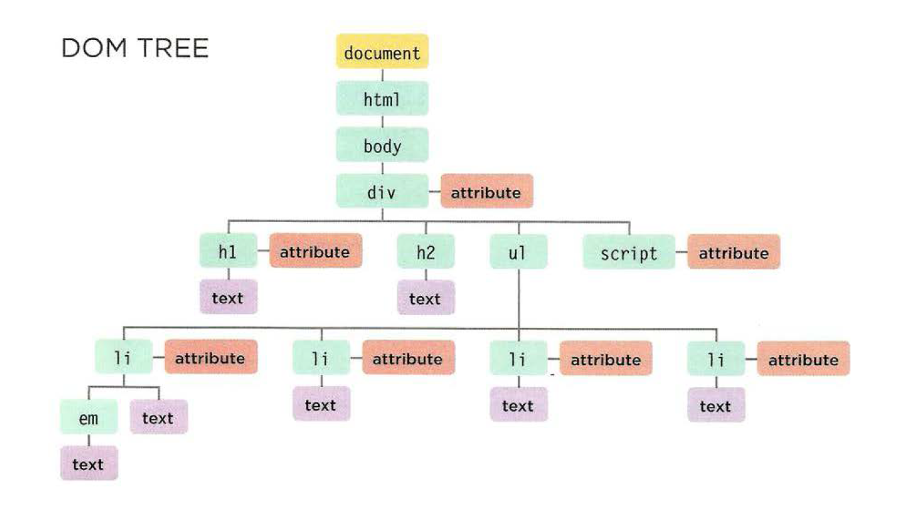

# Objects:
## Defintion: 
> Objects group together a set of variables and functions to create a model
of a something you would recognize from the real world. In an object,
variables and functions take on new names.
* Variables ====> Properties.
* Functions ====> Methods (tasks).


## Dot notation:
Access property or method: name of the object, followed by a period then the name of property or method. 

<br>


## Creating an Object:

```javascript
let x = new Object();
x.property1 = value;
x.property2 = value;
x.property3 = vaalue;

x.method = function() {
  code here;
};
```
___
<br>

# Document Object Model (DOM):  

>Specifies how browsers should create a model of an HTML page and how JavaScript can access and update the contents of a web page while it is in the browser window.

* DOM is a separate set of rules.
It is implemented by all major browser makers.

* The DOM specifies the way in which the
browser should structure this model using
a DOM tree.

> The DOM also defines methods and
properties to access and update each
object in this model, which in turn updates
what the user sees in the browser.

* **APls** let programs (and scripts)
talk to each other.

## DOM Tree:
 
 * The document node.
 * Element nodes.
 * Attributes nodes.
 * Text nodes.
 <br>
 <br>
 

 ## Accessing the elements:
 1. Individual elemnts
 2. Multiple elements.
 3. Travering between elements.

 > Methods that find elements in the DOM tree are called DOM queries. When you need to work with an element more than once, you should use a variable to store the result of this query.

<br>


 > When people talk about storing elements in variables, they are really storing the location of the element(s) within the DOM tree in a variable. The properties and methods of that element node work on the variable.
 
  


